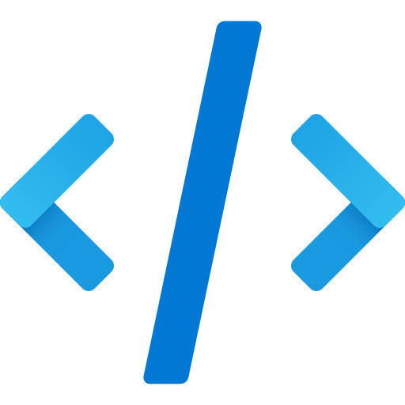
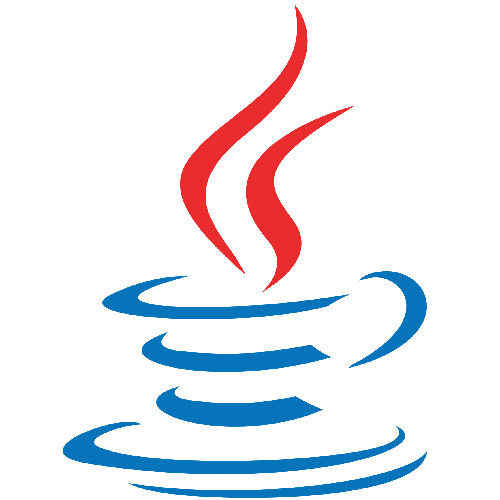
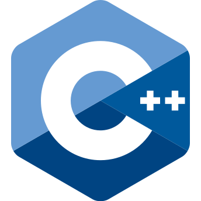
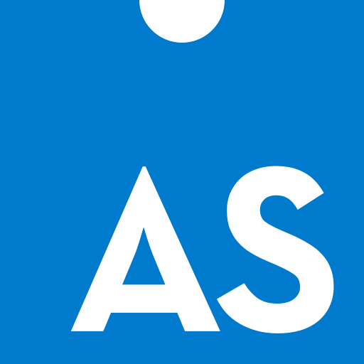

<!-- Top of README anchor -->

<!-- PROJECT LOGO -->
 

  
  <h3 align="center">My Coding Journey</h3>

  

    Click to see the programs I built along the way 👇🏼
  

  
  

    
    &nbsp;
    
    &nbsp;
    
    &nbsp;
    
  

    
  

    <a href="https://github.com/ow-n/Practice-Projects/tree/main/Java/Card%20Game"><strong>Latest project »</strong></a>
  

  

---

##  Java Programs
- Card Game
- Student Scores

Small Programs: ships / savingsaccount / salesdata / storinginfo / cointoss
   

##  C++ Programs
Programming Challenges:
- colorMixer
- daysInAMonth
- numberAnalysisIO
- numberGuessingGame
- printingASCIICodes
- rockPaperScissors

Other programs that use:
- Functions / Loops / Files / Arrays
   

##  Python Programs
   

##  Assembly Programs
1) Intro to Mips
- Dealing with Names and Age
- Simple Addition
   

<!-- CONTACT -->
## Contact
[![LinkedIn][linkedin-shield]][linkedin-url]

(<a href="#readme-top">back to top</a>)
    <!Back To Top>

<!-- MARKDOWN LINKS & IMAGES -->
<!-- https://www.markdownguide.org/basic-syntax/#reference-style-links -->
[forks-shield]: https://img.shields.io/github/forks/ow-n/Practice-Projects.svg?style=for-the-badge
[forks-url]: https://github.com/ow-n/Practice-Projects/network/members
[stars-shield]: https://img.shields.io/github/stars/ow-n/Practice-Projects.svg?style=for-the-badge
[stars-url]: https://github.com/ow-n/Practice-Projects/stargazers
[issues-shield]: https://img.shields.io/github/issues/ow-n/Practice-Projects.svg?style=for-the-badge
[issues-url]: https://github.com/ow-n/Practice-Projects/issues
[license-shield]: https://img.shields.io/github/license/ow-n/Practice-Projects.svg?style=for-the-badge
[license-url]: https://github.com/ow-n/Practice-Projects/blob/master/LICENSE.txt
[linkedin-shield]: https://img.shields.io/badge/LinkedIn-%230077B5.svg?style=for-the-badge&logo=linkedin&logoColor=white
[linkedin-url]: https://www.linkedin.com/in/owenman/

[Java.link]: https://github.com/ow-n/Practice-Projects/tree/main/Java
[Java]: https://img.shields.io/badge/Java-ED8B00?style=for-the-badge&logo=java&logoColor=white
[Cplusplus.link]: https://github.com/ow-n/Practice-Projects/tree/main/C%2B%2B
[Cplusplus]: https://img.shields.io/badge/C%2B%2B-00599C?style=for-the-badge&logo=cplusplus&logoColor=white
[Assembly.link]: https://github.com/ow-n/Practice-Projects/tree/main/Assembly
[Assembly]: https://img.shields.io/badge/Assembly-654FF0?style=for-the-badge&logo=generic&logoColor=white
[HTML5.link]: https://github.com/ow-n/Practice-Projects
[HTML5]: https://img.shields.io/badge/HTML5-E34F26?style=for-the-badge&logo=html5&logoColor=white